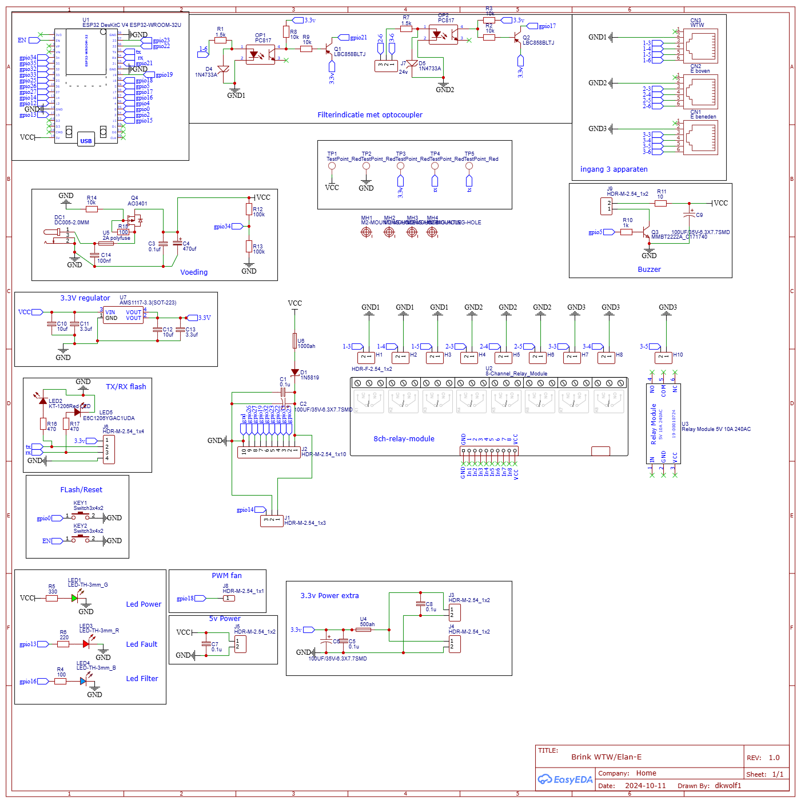

# Brink-PCB
PCB to connect Brink Renovent and Elan

Busy with webinterface and MQTT

I integrated in esphome, work like a charm. Check yaml

## Extra webinterface

The firmware now enables the ESPHome `web_server` component. Browse to the
device IP address to access a simple control panel. A minimal example page is
provided in [`web/index.html`](web/index.html) which can be uploaded using the
ESPHome dashboard or served separately.

