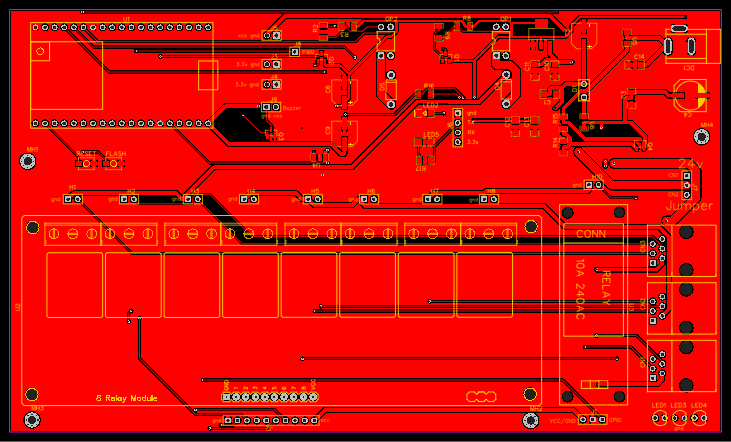

# Brink-PCB
PCB to connect Brink Renovent and Elan

Busy with webinterface and MQTT

I integrated in esphome, work like a charm. Check yaml

## Firmware options

You can either flash the device using ESPHome or compile the Arduino sketch
yourself. The ESPHome configuration is provided in [`Wtw.yaml`](Wtw.yaml). If you
prefer the Arduino IDE, follow the steps below to build the sketch in
[`arduino/BrinkWTW.ino`](arduino/BrinkWTW.ino).

## Compiling the Arduino sketch

1. Install the required libraries in the Arduino IDE using the Library Manager:
   - **ESPAsyncWebServer**
   - **AsyncTCP**
2. Open `arduino/BrinkWTW.ino` in the Arduino IDE.
3. Select an ESP32 board (for example **ESP32 Dev Module**) and upload the
   sketch to your device.

## Extra webinterface

The firmware now enables the ESPHome `web_server` component. Browse to the
device IP address to access a simple control panel. A minimal example page is
provided in [`web/index.html`](web/index.html) which can be uploaded using the
ESPHome dashboard or served separately.

